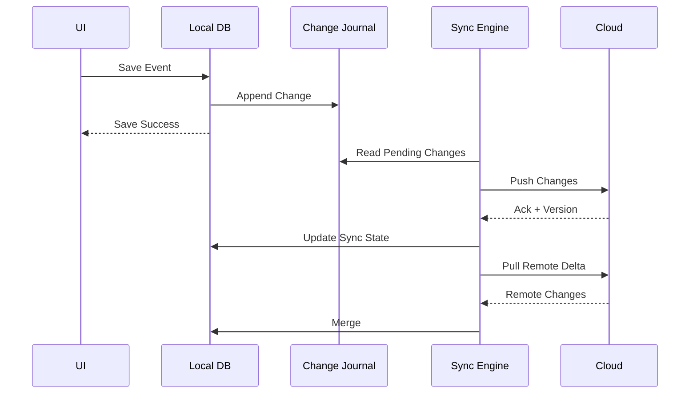
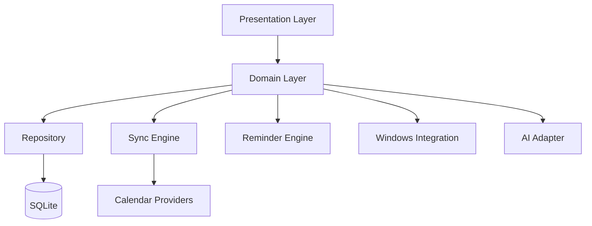
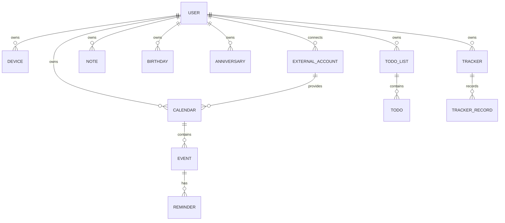

# 桌面日历与个人时间管理平台——软件产品开发需求说明书（PRD + SRS）

> **项目代号**：TimeHub Desktop  
> **文档类型**：产品需求文档 PRD + 软件需求规格说明 SRS + 验收标准  
> **版本**：V1.0  
> **状态**：可用于产品评审 / UI 设计 / 技术方案设计 / 研发拆分 / 测试用例设计  
> **目标平台**：Windows 桌面端优先，架构预留 macOS / iOS / Android / HarmonyOS / Web  
> **参考对象**：优效日历公开产品页面及用户提供的界面截图  
> **编写日期**：2026-08-31  
> **文档语言**：中文  
>
> **说明**：本文是一份“同类桌面日历与时间管理软件”的独立研发规格，不对任何第三方软件的内部源码、数据库结构或私有实现进行推断。开发时不得直接复制第三方商标、品牌名称、图标、插画、受版权保护的 UI 素材或专有文案；可以基于公开可见的产品能力进行同类功能设计与独立实现。

---

# 1. 文档目标

本文用于定义一款面向个人及轻量团队的桌面日历与时间管理软件，从产品范围、用户体验、功能需求、数据模型、同步机制、第三方日历接入、系统集成、AI 辅助、非功能需求、安全隐私、测试和验收等方面形成可直接进入研发流程的完整规范。

本文应作为以下团队的统一输入：

- 产品经理：产品范围、优先级、交互逻辑、业务规则。
- UI/UX：信息架构、页面状态、组件状态、视觉规范。
- 客户端研发：桌面窗口、系统托盘、通知、桌面组件、快捷键、数据层。
- 后端研发：账号、云同步、分享、订阅、AI 网关、配置备份。
- 测试：功能测试、同步测试、协议兼容测试、性能测试、异常测试。
- 运维：服务可用性、日志、告警、备份、版本发布。
- 安全：凭据保护、数据加密、权限、隐私与第三方账号隔离。

---

# 2. 产品概述

## 2.1 产品定位

TimeHub Desktop 是一款以“桌面时间入口”为核心的个人时间管理平台。

它不是单纯的月历，而是把以下能力聚合到一个统一产品中：

1. 日期、农历、节气、节假日、天气查询。
2. 日程管理。
3. 待办任务。
4. 便签与轻笔记。
5. 生日、纪念日、倒数日。
6. 习惯/事件追踪。
7. 排班管理。
8. Outlook / iCloud / Exchange / CalDAV / ICS 等第三方日历聚合。
9. 桌面组件、任务栏时钟、悬浮时钟等系统增强。
10. 日期计算、世界时钟、番茄钟等时间工具。
11. AI 自然语言创建日程、待办与时间分析。
12. 多端同步、备份、导入导出和分享。

核心理念：

> **用户无需在“日历、任务、备忘录、天气、倒计时、系统时钟、第三方日历”之间频繁切换，即可在一个统一时间轴中完成安排、查看、提醒和复盘。**

---

## 2.2 核心产品价值

### 2.2.1 高频入口

用户点击任务栏时间区域、系统托盘图标或快捷键即可快速打开日历面板。

### 2.2.2 信息集中

将工作、个人、家庭、生日、节假日、第三方会议、订阅日历统一显示。

### 2.2.3 Local-first

日历、待办、便签等基础数据首先保存本地，即使断网也能正常使用。

### 2.2.4 多端同步

登录后可以在多设备之间同步数据，同时允许用户关闭云同步，仅本地使用。

### 2.2.5 低打扰提醒

根据事项的重要程度和用户设置提供分级提醒，避免无效通知过多。

### 2.2.6 可扩展

系统采用“业务核心 + 日历适配器 + 系统能力适配器 + 云服务”的模块化结构，为后续平台扩展提供基础。

---

# 3. 产品目标与非目标

## 3.1 产品目标

首个正式版本应实现：

- Windows 桌面日历。
- 任务栏/托盘快速日历。
- 日 / 周 / 月 / 年基本日历能力。
- 农历、节气、节日、法定节假日显示。
- 日程 CRUD。
- 重复日程。
- 多级提醒。
- 待办清单。
- 待办四象限。
- 便签。
- 生日、纪念日、倒数日。
- 排班助手。
- 第三方日历接入框架。
- Outlook / CalDAV / ICS 首批接入。
- 本地通知。
- 桌面组件。
- 日期计算、世界时钟、番茄钟等工具。
- 数据导入导出。
- 账号和云同步。
- 全局搜索。
- 深色 / 浅色主题。

第二阶段实现：

- macOS。
- iOS / Android。
- iCloud 深度接入。
- Exchange 企业账号。
- 企业微信、钉钉、飞书等日历连接。
- AI 助手。
- 日程分享。
- 微信/网页轻量分享。
- 习惯追踪统计。
- 高级桌面组件。
- 多设备实时同步。

---

## 3.2 非目标

V1.0 不作为以下产品的完整替代品：

- 企业级项目管理系统，如 Jira。
- 企业 ERP。
- 完整 CRM。
- 完整知识库。
- 企业 OA。
- 专业排班人力资源系统。
- 视频会议系统。
- 邮件客户端。

对于以上能力，只提供必要的数据联动，不承担其完整业务流程。

---

# 4. 目标用户

## 4.1 办公用户

典型需求：

- 公司会议。
- Outlook 日历。
- 每周例会。
- 项目节点。
- 领导临时安排。
- 工作待办。
- 截止日期。
- 桌面提醒。

## 4.2 研发人员

典型需求：

- 研发会议。
- 版本发布。
- Bug 截止日期。
- 测试计划。
- 倒数日。
- 工作日计算。
- 多时区会议。

## 4.3 项目经理

典型需求：

- 跨周/月查看项目里程碑。
- 多日历叠加。
- 会议冲突分析。
- 多级提醒。
- 周视图。
- 长周期计划。

## 4.4 学生

典型需求：

- 课程表。
- 考试日期。
- 作业截止时间。
- 番茄钟。
- 倒计时。
- 学习计划。

## 4.5 行政 / HR

典型需求：

- 员工生日。
- 节假日。
- 入职 / 转正 / 合同节点。
- 团建。
- 会议。
- 纪念日。

## 4.6 轮班用户

典型需求：

- 白班 / 夜班。
- 两班倒。
- 三班倒。
- 做二休二。
- 自定义轮班周期。
- 班次统计。

---

# 5. 产品范围和版本规划

| 阶段 | 范围 | 目标 |
|---|---|---|
| MVP | Windows、本地日历、日程、提醒、待办、农历、节假日 | 建立可独立使用的桌面时间管理核心 |
| V1.0 | 同步、第三方日历、便签、生日、纪念日、排班、桌面组件 | 形成完整桌面产品 |
| V1.5 | Outlook / CalDAV / ICS 稳定化、分享、数据导入导出 | 增强生态兼容 |
| V2.0 | macOS、Android、iOS、AI 助手 | 多平台时间管理 |
| V2.5 | 企业日历、团队共享、会议时间建议 | 扩展办公场景 |

---

# 6. 需求优先级定义

采用 MoSCoW：

| 标识 | 含义 |
|---|---|
| P0 / Must | 缺失则版本不能发布 |
| P1 / Should | 高价值，原则上本版本实现 |
| P2 / Could | 有价值，可根据资源后移 |
| P3 / Future | 后续规划 |

---

# 7. 信息架构

```text
TimeHub
├─ 快速日历面板
│  ├─ 今日信息
│  ├─ 月历
│  ├─ 今日事项
│  ├─ 日程摘要
│  └─ 快速创建
│
├─ 日程管理
│  ├─ 日视图
│  ├─ 三日视图
│  ├─ 周视图
│  ├─ 月视图
│  ├─ 年视图
│  ├─ 日历列表
│  └─ 搜索
│
├─ 待办清单
│  ├─ 今天
│  ├─ 计划
│  ├─ 全部
│  ├─ 已完成
│  ├─ 四象限
│  ├─ 看板
│  └─ 统计
│
├─ 排班助手
├─ 日历订阅
├─ 便签
├─ 追踪
│  ├─ 习惯追踪
│  ├─ 生日
│  ├─ 纪念日
│  ├─ 节日
│  └─ 节气
│
├─ 日期时钟工具
│  ├─ 计时秒表
│  ├─ 日期计算
│  ├─ 世界时钟
│  ├─ 时间进度
│  ├─ 良辰吉日
│  ├─ 番茄钟
│  ├─ 抢票日历
│  └─ 节日节气
│
├─ 系统工具
│  ├─ 定时任务
│  ├─ 桌面插件
│  ├─ 整点报时
│  ├─ 久坐提醒
│  ├─ 悬浮时钟
│  ├─ 截图工具
│  ├─ 钉图片
│  └─ 云复制
│
└─ 账号与设置
   ├─ 云同步
   ├─ 第三方账号
   ├─ 通知
   ├─ 显示
   ├─ 快捷键
   ├─ 数据管理
   ├─ 隐私
   └─ 关于
```

---

# 8. 核心交互入口

## 8.1 系统托盘

系统托盘应支持：

- 单击：打开快速日历面板。
- 双击：打开日程管理主窗口。
- 右键：
  - 新建日程。
  - 新建待办。
  - 新建便签。
  - 打开主窗口。
  - 同步。
  - 暂停提醒。
  - 设置。
  - 退出。

### 验收标准

- P0：托盘菜单打开时间 ≤ 200 ms。
- P0：软件主窗口关闭后可以选择继续驻留托盘。
- P0：退出软件必须明确区分“关闭窗口”和“退出程序”。

---

## 8.2 全局快捷键

默认建议：

| 操作 | 默认快捷键 |
|---|---|
| 打开快速日历 | Alt + Space 或用户自定义 |
| 新建日程 | Ctrl + Alt + E |
| 新建待办 | Ctrl + Alt + T |
| 新建便签 | Ctrl + Alt + N |
| 全局搜索 | Ctrl + Alt + K |

要求：

- 所有快捷键可关闭。
- 所有快捷键可修改。
- 快捷键冲突时提示用户。
- 禁止抢占系统保留快捷键。

---

# 9. 快速日历面板

## 9.1 页面目标

快速面板用于完成“看时间 → 看日期 → 看今天安排 → 快速进入详情”的高频路径。

## 9.2 页面结构

建议包括：

### 左区域

1. 今日日期卡片。
2. 公历日期。
3. 星期。
4. 一年中的第几天。
5. 第几周。
6. 星座，可选。
7. 农历。
8. 干支，可选。
9. 宜 / 忌，可选。
10. 今日摘要：
    - 日程。
    - 待办。
    - 节日。
    - 便签。
11. 今日时间段日程。
12. 时间格言或用户自定义信息卡片。

### 右区域

1. 大号当前时间。
2. 当前日期。
3. 农历日期。
4. 天气。
5. 当前月月历。
6. 节假日 / 调休标记。
7. 节气标记。
8. 当前选中日期。
9. 快速创建按钮。
10. 底部导航。

---

## 9.3 月历显示规则

### CAL-QP-001

月历必须显示：

- 当前月。
- 上月尾部日期。
- 下月头部日期。
- 星期标题。
- 当前日期。
- 选中日期。
- 农历日期。
- 节假日。
- 节气。
- 日程存在标识。

### CAL-QP-002

颜色规则：

- 当前日期：强调色圆形背景。
- 周末：可使用区别色。
- 法定休息日：显示“休”。
- 调班工作日：显示“班”。
- 节气：强调文字。
- 其他月份日期：降低透明度。
- 有日程：日期下方显示圆点或数量标识。

### CAL-QP-003

用户点击日期后：

- 左侧内容更新为所选日期。
- 下方日程区域展示当日日程。
- 双击日期进入新建日程。
- 右键打开快捷菜单。

---

# 10. 日程管理

# 10.1 日历视图

必须实现：

- 日视图。
- 三日视图。
- 周视图。
- 月视图。
- 年视图。
- 日程列表视图。

### CAL-001 月视图

要求：

- 一个完整月网格。
- 每个日期格显示最多 N 条日程。
- 超出数量显示“+X 更多”。
- 点击“更多”弹出当日完整列表。
- 支持跨月查看。
- 支持鼠标滚轮切换月份。
- 可选连续纵向滚动模式。
- 支持拖拽日程改变日期。

### CAL-002 周视图

要求：

- 纵轴：时间。
- 横轴：星期。
- 全天日程独立区域。
- 支持 15/30/60 分钟网格。
- 支持拖动移动。
- 支持拉伸改变开始/结束时间。
- 支持当前时间线。
- 支持工作时间范围突出显示。

### CAL-003 日视图

要求：

- 24 小时时间轴。
- 支持全天事件。
- 支持多个重叠日程并列显示。
- 支持滚动到当前时间。
- 支持快速添加空白时间段。

### CAL-004 年视图

要求：

- 展示 12 个月缩略月历。
- 支持点击进入指定月份。
- 标记节假日和重要日程。
- 可显示年度日程热度。

---

# 10.2 内置日历

默认提供：

- 默认。
- 工作。
- 个人。
- 家庭。

用户可以：

- 新建日历。
- 修改名称。
- 修改颜色。
- 修改图标。
- 隐藏 / 显示。
- 设置默认新建日历。
- 删除。
- 导出。
- 设置只读。
- 调整排序。

每个日历数据字段：

```text
Calendar
- id
- account_id
- name
- color
- icon
- is_visible
- is_default
- is_readonly
- timezone
- source_type
- external_id
- sync_token
- created_at
- updated_at
- deleted_at
```

---

# 10.3 新建日程

## EVT-001 基本信息

字段：

| 字段 | 必填 | 说明 |
|---|---|---|
| 标题 | 是 | 最大 200 字 |
| 日历 | 是 | 默认使用用户默认日历 |
| 开始时间 | 是 | 日期 + 时间 |
| 结束时间 | 是 | 必须 ≥ 开始时间 |
| 全天 | 否 | 全天事件 |
| 地点 | 否 | 最大 500 字 |
| 备注 | 否 | 富文本/Markdown 二选一 |
| 颜色 | 否 | 可继承日历颜色 |
| 标签 | 否 | 多选 |
| 时区 | 否 | 默认本地时区 |
| 重复 | 否 | RFC 5545 RRULE |
| 提醒 | 否 | 支持多个 |
| URL | 否 | 会议或外部链接 |
| 参与者 | 否 | 后续团队版本 |
| 附件 | 否 | P2 |

---

## EVT-002 快速创建

用户输入：

```text
明天下午3点研发周会 会议室5
```

系统可解析：

```text
标题：研发周会
时间：明日 15:00
地点：会议室5
```

若 AI 功能未启用，至少实现规则解析：

- 今天。
- 明天。
- 后天。
- 周一～周日。
- 上午 / 中午 / 下午 / 晚上。
- HH:mm。
- X 点。
- X 月 X 日。

系统必须显示确认界面后再保存。

---

# 10.4 全天日程

全天日程规则：

- 不使用具体时间。
- 在日视图 / 周视图顶部展示。
- 月视图显示在日期单元格中。
- 跨日全天事件必须连续显示。

---

# 10.5 重复日程

## EVT-REC-001

必须支持：

- 每天。
- 每个工作日。
- 每周。
- 每两周。
- 每月。
- 每年。
- 自定义。

## EVT-REC-002 自定义重复

支持：

- 每 N 天。
- 每 N 周的周一、周三、周五。
- 每月第 N 天。
- 每月最后一天。
- 每月第 3 个周五。
- 每年指定日期。
- 直到某日期。
- 重复 N 次。
- 永不结束。

建议兼容 RFC 5545：

```text
RRULE:FREQ=WEEKLY;INTERVAL=1;BYDAY=MO,WE,FR
```

### 修改重复日程时必须询问

- 仅此日程。
- 此日程及以后。
- 整个系列。

---

# 10.6 多级提醒

支持单个日程多个提醒：

```text
提前 1 天
提前 2 小时
提前 15 分钟
开始时
```

提醒方式：

- Windows Toast。
- 应用弹窗。
- 声音。
- 系统托盘闪烁。
- 手机推送，云端版本。
- 邮件，P2。
- Webhook，P3。

### REM-001

用户必须可以：

- 稍后 5 分钟提醒。
- 稍后 10 分钟。
- 稍后 30 分钟。
- 稍后 1 小时。
- 自定义。
- 标记完成。
- 打开日程。
- 关闭本次提醒。

---

# 10.7 日程拖拽

### 月视图

拖动事件：

```text
8 月 31 日 → 9 月 1 日
```

结果：

- 日期改变。
- 时间保持不变。
- 同步产生 UPDATE 变更。

### 周视图

支持：

- 横向拖动改变日期。
- 纵向拖动改变时间。
- 拉伸顶部改变开始时间。
- 拉伸底部改变结束时间。

要求：

- 拖动前保存原值。
- 拖动失败可回滚。
- 第三方只读日历禁止拖动。

---

# 10.8 日程冲突

当两个事件时间重叠：

- 默认允许创建。
- 显示冲突提示。
- 提供“仍然创建”。
- 提供“查看冲突”。
- AI/排程版本可推荐空闲时间。

---

# 10.9 搜索日程

搜索字段：

- 标题。
- 备注。
- 地点。
- 标签。
- 参与者。
- 日历名。

过滤条件：

- 日期范围。
- 日历。
- 标签。
- 是否重复。
- 是否全天。
- 已过去 / 未来。

---

# 11. 节假日、农历和节气

## 11.1 中国农历

显示：

- 农历月。
- 农历日。
- 干支，可选。
- 生肖，可选。
- 传统节日。

## 11.2 二十四节气

示例：

- 立春。
- 清明。
- 立秋。
- 处暑。
- 中元节等传统日期可作为节日数据。

## 11.3 法定节假日

必须支持：

- 休息日。
- 调班工作日。
- 节日名称。

数据需要按年份维护。

### 数据策略

建议：

```text
HolidayDataset
- region
- year
- date
- type = HOLIDAY | WORKDAY_ADJUSTMENT
- name
- source_version
```

节假日数据升级不依赖客户端版本，可通过远程配置更新。

---

# 12. 待办清单

## 12.1 待办模型

```text
Todo
- id
- list_id
- title
- description
- priority
- status
- start_at
- due_at
- completed_at
- reminder_rules
- repeat_rule
- parent_id
- sort_order
- quadrant
- estimated_minutes
- actual_minutes
- tags
- created_at
- updated_at
- deleted_at
```

---

# 12.2 基本功能

用户可以：

- 新建。
- 编辑。
- 删除。
- 完成。
- 恢复完成。
- 设置截止日期。
- 设置开始日期。
- 设置优先级。
- 设置提醒。
- 设置重复。
- 添加标签。
- 添加子任务。
- 添加备注。
- 拖动排序。
- 移动到清单。

---

# 12.3 待办入口

左侧导航：

- 今天。
- 计划。
- 全部。
- 已完成。
- 统计信息。

标签区：

- 个人。
- 学习。
- 家庭。
- 工作。
- 生活。
- 锻炼。

标签由用户自定义。

---

# 12.4 四象限

四象限视图：

| 象限 | 含义 | 建议 UI |
|---|---|---|
| I | 重要且紧急 | 红色系 |
| II | 重要但不紧急 | 橙色系 |
| III | 紧急但不重要 | 蓝色系 |
| IV | 不重要不紧急 | 绿色系 |

每个象限支持：

- 拖入任务。
- 拖出任务。
- 象限内排序。
- 快速创建。
- 完成任务。
- 展开详情。

业务规则：

```text
Quadrant I   -> DO_NOW
Quadrant II  -> PLAN
Quadrant III -> DELEGATE
Quadrant IV  -> REDUCE
```

---

# 12.5 看板模式

列可配置：

```text
待处理 → 进行中 → 等待 → 已完成
```

支持：

- 拖拽。
- WIP 数量限制，P2。
- 自定义列，P2。

---

# 12.6 待办统计

统计：

- 今日完成。
- 本周完成。
- 完成率。
- 逾期数量。
- 标签分布。
- 象限分布。
- 连续完成天数。

---

# 13. 排班助手

## 13.1 产品目标

帮助轮班工作人员快速生成周期班表，并同步到日历。

## 13.2 班次定义

用户可创建：

```text
白班 08:00-20:00
夜班 20:00-08:00
休息
培训 09:00-17:00
```

字段：

```text
ShiftType
- id
- name
- start_time
- end_time
- color
- icon
- is_rest
- duration
```

## 13.3 排班周期

支持：

- 做一休一。
- 做二休二。
- 白白夜夜休休。
- 三班倒。
- 用户自定义序列。

示例：

```text
白班 → 白班 → 夜班 → 夜班 → 休 → 休
```

用户指定：

- 周期起点。
- 班次序列。
- 结束日期。

系统自动生成。

## 13.4 手工排班

用户可点击日期：

- 新增班次。
- 修改班次。
- 清空班次。
- 复制上一周期。
- 批量选择日期。

## 13.5 排班同步

班次可以：

- 仅保存在排班模块。
- 同步生成日程。
- 生成提醒。

必须防止重复生成。

---

# 14. 日历订阅和第三方账号

## 14.1 账号中心

页面分为：

- 其他账户。
- 网络日历。

支持的适配器规划：

| 类型 | 优先级 |
|---|---|
| Outlook / Microsoft 365 | P0 |
| Exchange | P1 |
| CalDAV | P0 |
| ICS URL | P0 |
| iCloud | P1 |
| 企业微信 | P2 |
| 钉钉 | P2 |
| 飞书 | P2 |
| 腾讯会议 | P2 |
| WPS 日历 | P3 |
| QQ 邮箱日历 | P3 |

---

# 14.2 Outlook / Microsoft 365

推荐使用 Microsoft Graph + OAuth 2.0。

必须支持：

- 登录授权。
- 列出日历。
- 选择同步日历。
- 拉取事件。
- 创建事件。
- 修改事件。
- 删除事件。
- 增量同步。
- Token 自动刷新。
- 断开连接。

禁止：

- 明文保存 Microsoft 密码。
- 收集用户邮箱密码。

---

# 14.3 CalDAV

配置项：

```text
服务器地址
用户名
密码 / App Password
Base URL
同步间隔
```

支持：

- PROPFIND。
- REPORT。
- GET。
- PUT。
- DELETE。
- ETag。
- CTag / sync-token，如果服务器支持。

兼容要求：

- Nextcloud。
- ownCloud。
- Synology Calendar。
- 标准 CalDAV Server。

---

# 14.4 ICS 订阅

支持：

- URL 订阅。
- 本地 ICS 文件导入。
- 手动刷新。
- 自动刷新。
- 只读日历。

自动刷新间隔：

- 15 分钟。
- 30 分钟。
- 1 小时。
- 6 小时。
- 24 小时。

---

# 14.5 网络日历

网络日历可以用于：

- 节日。
- 体育赛事。
- 发布计划。
- 课程。
- 公司日历。
- 社区活动。

要求：

- 网络订阅默认只读。
- 网络异常不能影响本地日历。
- 更新失败使用缓存。

---

# 15. 便签与轻笔记

## 15.1 便签列表

页面要求：

- 搜索栏。
- 标签过滤。
- 列表 / 网格切换。
- 新建按钮。
- 卡片预览。
- 修改日期。
- 字数。

## 15.2 Note 数据模型

```text
Note
- id
- title
- content
- content_format
- color
- is_pinned
- tags
- linked_event_ids
- linked_todo_ids
- created_at
- updated_at
- deleted_at
```

## 15.3 编辑能力

P0：

- 纯文本。
- 自动保存。
- 搜索。
- 标签。
- 置顶。
- 删除。

P1：

- Markdown。
- 标题。
- 列表。
- 粗体。
- 链接。

P2：

- 图片。
- 附件。
- OCR。
- AI 总结。

---

# 16. 追踪记录

## 16.1 追踪类型

支持：

- 是/否打卡。
- 数值。
- 时长。
- 次数。
- 文本记录。
- 评分。

示例：

```text
运动       是/否
喝水       8 杯
睡眠       7.5 小时
阅读       40 分钟
体重       72.3
心情       4/5
```

## 16.2 统计

提供：

- 周统计。
- 月统计。
- 连续天数。
- 完成率。
- 趋势图。
- 日历热力图。

---

# 17. 生日管理

## 17.1 基本字段

```text
Birthday
- id
- name
- date
- calendar_type = SOLAR | LUNAR
- birth_year
- relationship
- reminder_days_before
- repeat_yearly
- notes
```

## 17.2 生日提醒

支持：

- 当天。
- 提前 1 天。
- 提前 3 天。
- 提前 7 天。
- 自定义。

## 17.3 批量能力

- 批量导入。
- CSV 导入。
- 批量管理。
- 导出。
- 联系人同步，P2。

---

# 18. 纪念日和倒数日

## 18.1 纪念日

场景：

- 结婚纪念。
- 入职纪念。
- 项目启动。
- 公司成立。
- 旅行纪念。

支持自动计算：

```text
已经过去 X 天
第 X 周年
距离下次周年还有 X 天
```

## 18.2 倒数日

场景：

- 考试。
- 出差。
- 旅行。
- 产品发布。
- 交付节点。

显示：

```text
还有 12 天
还有 3 小时
已过去 5 天
```

---

# 19. 日期与时间工具

## 19.1 计时秒表

功能：

- 开始。
- 暂停。
- 继续。
- 计次。
- 清零。

## 19.2 日期计算

至少支持：

### 间隔计算

输入：

```text
2026-09-01
2026-12-31
```

输出：

```text
121 天
17 周 + 2 天
```

### 日期推算

输入：

```text
2026-09-01 + 100 天
```

输出目标日期。

### 工作日计算

支持排除：

- 周末。
- 法定节假日。
- 自定义休息日。

---

# 19.3 世界时钟

支持：

- 城市搜索。
- 时区搜索。
- UTC Offset。
- 夏令时。
- 多城市同时显示。

---

# 19.4 时间进度

提供：

- 今天进度。
- 本周进度。
- 本月进度。
- 本年进度。

示例：

```text
2026 年已过去 66.6%
今天已过去 72%
```

---

# 19.5 番茄钟

默认：

```text
专注 25 min
短休息 5 min
长休息 15 min
```

用户可自定义。

功能：

- 开始。
- 暂停。
- 跳过。
- 完成统计。
- 与待办关联。
- 专注时自动减少通知，P1。

---

# 19.6 良辰吉日

如果产品面向中国用户，可作为可选模块。

要求：

- 默认关闭敏感推荐式表达。
- 定位为传统文化信息查询。
- 清楚标记“仅供文化娱乐参考”。

---

# 20. 系统工具

# 20.1 定时任务

可配置：

- 定时提醒。
- 定时打开程序。
- 定时打开 URL。
- 定时执行脚本，建议高级模式。
- 定时关机。
- 定时重启。
- 定时锁屏。

安全要求：

- 执行脚本必须二次确认。
- 首次执行显示风险提示。
- 高权限操作需要系统 UAC。

---

# 20.2 整点报时

设置：

- 启用时间段。
- 工作日。
- 声音。
- 音量。
- 整点。
- 半点，可选。

---

# 20.3 久坐提醒

用户配置：

```text
工作 50 分钟
休息 10 分钟
```

支持：

- 暂停。
- 延后。
- 工作时间段。
- 会议期间自动静音，P2。

---

# 20.4 悬浮时钟

显示：

- 时间。
- 日期。
- 星期。
- 秒。
- CPU/内存，可选，P3。
- 天气，可选。

要求：

- 始终置顶。
- 鼠标穿透。
- 透明度。
- 字体。
- 位置记忆。

---

# 20.5 截图工具

基础：

- 矩形截图。
- 全屏。
- 窗口。
- 复制到剪贴板。
- 保存文件。

增强：

- 标注。
- 箭头。
- 文本。
- 马赛克。
- OCR，P2。

---

# 20.6 钉图片

用户截图后可：

- 将图片固定在桌面顶部。
- 调透明度。
- 缩放。
- 置顶。
- 多张图片。

---

# 20.7 云复制

目标：

在登录设备之间同步临时剪贴板文本。

安全要求：

- 默认关闭。
- 文本端到端加密为 P1。
- 密码、银行卡号、Token 等敏感内容不自动同步。
- 提供自动清理时间。

---

# 21. 桌面组件

## 21.1 组件类型

至少包括：

1. 月历。
2. 今日日程。
3. 待办。
4. 便签。
5. 天气。
6. 时钟。
7. 倒数日。
8. 番茄钟。
9. 年度进度。

## 21.2 组件通用能力

- 拖动。
- 调整大小。
- 透明度。
- 主题。
- 置顶。
- 鼠标穿透。
- 锁定位置。
- 多显示器。
- DPI 自适应。

---

# 22. 任务栏时钟增强

Windows 版本可提供独立的时钟增强方式，但必须避免破坏系统稳定性。

显示配置：

```text
22:25
2026/08/31 周一
23°C
```

可配置：

- 12 / 24 小时。
- 秒。
- 日期。
- 星期。
- 农历。
- 天气。
- 字体。
- 字号。
- 行距。
- 对齐。

### 技术原则

优先：

- 独立透明窗口 Overlay。
- 官方可支持的 Shell 扩展方式。

不建议：

- 修改 Explorer 二进制。
- 注入未知 DLL。
- Hook 不稳定私有 API。

---

# 23. 天气

## 23.1 天气数据

显示：

- 当前天气。
- 温度。
- 体感温度。
- 最高 / 最低。
- 降雨概率。
- 空气质量，P1。

## 23.2 城市

支持：

- 自动定位。
- 手动城市。
- 多城市，P1。

隐私：

- 定位权限必须显式申请。
- 不允许无授权上传精确定位。

---

# 24. 全局搜索

搜索对象：

- 日程。
- 待办。
- 便签。
- 生日。
- 纪念日。
- 排班。
- 日历。
- 设置入口。

快捷键：

```text
Ctrl + K
```

搜索结果必须：

- 实时反馈。
- 高亮关键词。
- 可键盘上下选择。
- Enter 打开。
- 支持类型过滤。

性能目标：

- 本地 50,000 条记录下，首屏结果 ≤ 150 ms。

推荐使用：

- SQLite FTS5。
- 或本地倒排索引。

---

# 25. 通知中心

通知分类：

- 日程。
- 待办。
- 生日。
- 纪念日。
- 排班。
- 番茄钟。
- 久坐。
- 系统任务。
- 同步异常。

用户可配置：

- 每类总开关。
- 声音。
- 弹窗。
- 勿扰时段。
- 工作日。
- 周末。

---

# 26. AI 智能助手

> AI 模块建议作为独立可关闭能力，不能让基础日历依赖 AI 服务。

## 26.1 自然语言创建

用户：

```text
下周三下午两点和供应商开会，提前一天和半小时提醒我
```

系统输出草稿：

```text
标题：和供应商开会
日期：下周三
时间：14:00
提醒：
- 提前 1 天
- 提前 30 分钟
```

必须经过用户确认后写入。

---

# 26.2 自然语言查询

示例：

```text
我下周哪天下午有两个小时空闲？
```

系统：

1. 查询日历。
2. 计算冲突。
3. 返回候选时间。
4. 不自动修改任何日程。

---

# 26.3 AI 冲突分析

输入：

```text
把下周的研发评审安排到工作时间，找 90 分钟空档
```

输出：

- 周二 14:00-15:30。
- 周四 09:30-11:00。
- 周五 15:00-16:30。

---

# 26.4 AI 待办拆解

输入：

```text
月底前完成产品发布
```

可建议：

```text
确认版本范围
完成测试
完成发布说明
准备安装包
灰度发布
正式发布
发布后验证
```

用户勾选后创建。

---

# 26.5 AI 便签整理

支持：

- 摘要。
- 提取时间。
- 提取任务。
- 生成会议纪要。
- 转待办。

---

# 26.6 截图 / 划词 / 语音采集

P2：

- 截取聊天窗口中的时间信息。
- 从选中文字提取日期。
- 语音输入。

所有自动识别结果必须先形成草稿，避免误创建。

---

# 26.7 AI 安全

必须：

- 清晰展示哪些数据将发送给 AI。
- 用户可以关闭 AI。
- 默认不上传第三方账号密码。
- 默认不上传附件。
- AI 日志不记录敏感 Token。
- 企业版支持禁用云 AI。

---

# 27. 日程分享

## 27.1 分享形式

支持：

- 分享链接。
- ICS 文件。
- 二维码。
- 图片日程卡片，P1。

## 27.2 分享权限

模式：

- 公开只读。
- 仅知道链接的人可查看。
- 密码保护，P1。
- 有效期。

## 27.3 隐私

分享前可选择隐藏：

- 备注。
- 参与人。
- 私密地点。
- 附件。

---

# 28. 用户账号与云同步

## 28.1 账号方式

可选：

- 手机号。
- 邮箱。
- 第三方登录，P1。

## 28.2 未登录状态

必须支持本地使用：

- 日程。
- 待办。
- 便签。
- 生日。
- 纪念日。

未登录时不提供：

- 云同步。
- 多设备同步。
- 云分享。

---

# 29. Local-first 数据架构

核心原则：

```text
UI
 ↓
Domain Service
 ↓
Local Repository
 ↓
SQLite
 ↓
Change Journal
 ↓
Sync Engine
 ↓
Cloud / Third-party Adapter
```

用户的编辑首先写入本地数据库。

成功写入本地后 UI 即反馈成功。

网络同步异步进行。

禁止：

> 用户创建一个本地日程，因为云端暂时断网而无法保存。

---

# 30. 本地数据库

推荐 SQLite。

推荐开启：

```text
WAL Mode
Foreign Keys
FTS5
```

核心表：

```text
calendars
events
event_reminders
event_recurrences
todos
todo_lists
todo_tags
notes
birthdays
anniversaries
trackers
tracker_records
shifts
shift_assignments
external_accounts
sync_states
change_journal
attachments
settings
notifications
```

---

# 31. 核心 Event 数据模型

建议字段：

```sql
events
------
id TEXT PRIMARY KEY
calendar_id TEXT NOT NULL
external_id TEXT
uid TEXT
title TEXT NOT NULL
description TEXT
location TEXT

start_at INTEGER
end_at INTEGER
start_timezone TEXT
end_timezone TEXT

is_all_day INTEGER
recurrence_rule TEXT
recurrence_id TEXT
original_start_at INTEGER

status TEXT
transparency TEXT
visibility TEXT

color TEXT

created_at INTEGER
updated_at INTEGER
deleted_at INTEGER

version INTEGER
sync_status TEXT
```

---

# 32. 删除策略

所有同步对象采用软删除：

```text
deleted_at != NULL
```

原因：

- 需要同步 DELETE。
- 防止设备离线期间删除丢失。
- 支持短期恢复。

清理规则：

- 云端确认删除。
- 所有活跃设备同步。
- Tombstone 超过 30～90 天。
- 后台垃圾回收。

---

# 33. 同步引擎

## 33.1 状态

对象同步状态：

```text
CLEAN
DIRTY_CREATE
DIRTY_UPDATE
DIRTY_DELETE
SYNCING
CONFLICT
ERROR
```

## 33.2 同步流程



---

# 34. 增量同步

禁止每次完整同步全部数据。

应实现：

- 客户端 `sync_cursor`。
- 服务端 Change Feed。
- 第三方接口 Delta Token 或 ETag。
- 批量 Push。
- 批量 Pull。

---

# 35. 冲突解决

冲突定义：

```text
设备 A 修改 Event v10
设备 B 离线修改 Event v10
A 上传 → v11
B 上传 → 冲突
```

策略：

### 普通文本字段

默认：

- Last Writer Wins + 冲突记录。

### 时间字段

若两侧均改变：

- 进入冲突状态。
- 提示用户确认。

### 删除 vs 修改

默认：

- 删除优先，但保留恢复副本。

### 便签

可以尝试：

- 文本三方 Merge。
- Merge 失败保留两个版本。

---

# 36. 第三方日历适配器

统一接口：

```text
CalendarProvider
├─ Authenticate()
├─ ListCalendars()
├─ PullChanges()
├─ CreateEvent()
├─ UpdateEvent()
├─ DeleteEvent()
├─ RefreshToken()
└─ Disconnect()
```

不同平台分别实现：

```text
MicrosoftGraphProvider
CalDavProvider
IcsProvider
ICloudProvider
ExchangeProvider
FeishuProvider
DingTalkProvider
WeComProvider
```

---

# 37. 时区

必须使用 IANA 时区作为业务时区标识：

```text
Asia/Shanghai
America/Los_Angeles
Europe/Berlin
```

存储建议：

- 具体时间保存 UTC。
- 同时保存原始 TimeZone ID。
- 全天事件以日期语义保存，不强制转 UTC。

必须测试 DST：

- 夏令时开始。
- 夏令时结束。
- 跨时区事件。

---

# 38. RFC 5545 兼容

涉及：

- UID。
- DTSTART。
- DTEND。
- RRULE。
- EXDATE。
- RDATE。
- RECURRENCE-ID。
- VALARM。
- TZID。

必须覆盖复杂重复：

```text
每周一三五
每个月第一个星期一
每个月最后一个工作日
每年 9 月 1 日
```

---

# 39. 数据导入

支持：

## ICS

- 导入到指定日历。
- 显示导入预览。
- 重复 UID 检测。
- 支持 UTF-8。

## CSV

用于：

- 生日。
- 待办。
- 纪念日。

---

# 40. 数据导出

支持：

- 日历 → ICS。
- 待办 → CSV / JSON。
- 便签 → Markdown / TXT。
- 追踪 → CSV。
- 完整备份 → ZIP。

完整备份建议：

```text
backup.zip
├─ manifest.json
├─ database.json / sqlite snapshot
├─ notes/
├─ attachments/
└─ config.json
```

---

# 41. 配置云备份

备份对象：

- 主题。
- 快捷键。
- 显示选项。
- 日历颜色。
- 组件布局。
- 提醒设置。

第三方账号密码不得直接进入普通配置备份。

---

# 42. 凭据存储

Windows：

- Windows Credential Manager。
- 或 DPAPI。

macOS：

- Keychain。

移动端：

- Keychain / Android Keystore。

禁止：

```text
settings.json:
{
  "outlook_password": "123456"
}
```

---

# 43. 隐私与安全

## SEC-001 传输

所有云通信：

```text
TLS 1.2+
```

优先 TLS 1.3。

## SEC-002 Token

OAuth Token：

- 加密存储。
- 日志脱敏。
- 崩溃报告脱敏。

## SEC-003 最小权限

Outlook 权限按功能最小化申请。

## SEC-004 本地模式

用户可以：

```text
设置 → 云同步 → 关闭
```

关闭后：

- 本地数据不上传业务云。
- 第三方日历仅由对应 Provider 与第三方服务通信。

## SEC-005 删除账号

用户删除云账号时应：

1. 撤销登录。
2. 清理 Refresh Token。
3. 提供云数据删除入口。
4. 本地数据是否保留由用户选择。

---

# 44. 日志

日志级别：

```text
DEBUG
INFO
WARN
ERROR
FATAL
```

禁止写入：

- 密码。
- Access Token。
- Refresh Token。
- Cookie。
- 完整便签内容。
- 私密日程描述。

可记录：

```text
Sync failed
Provider=Microsoft
ErrorCode=429
CalendarIdHash=...
```

---

# 45. UI 视觉需求

## 45.1 风格

建议：

- 简洁桌面工具风格。
- 深色模式优先适配。
- 蓝色强调色。
- 中低对比度背景。
- 卡片式信息结构。
- 日历内容作为视觉中心。

## 45.2 深色主题

背景层级建议：

```text
Window Background
Panel Background
Card Background
Hover Background
Selected Background
```

文本层级：

```text
Primary
Secondary
Disabled
Accent
Danger
Warning
Success
```

---

# 46. 窗口体系

建议包括：

1. QuickPanel。
2. MainWindow。
3. TodoWindow。
4. NoteWindow。
5. TrackerWindow。
6. ShiftWindow。
7. WidgetWindow。
8. FloatingClock。
9. SettingsWindow。
10. ReminderPopup。

同一模块也可以使用单主窗口路由方式实现。

---

# 47. 窗口状态保存

保存：

- 大小。
- 位置。
- 最大化状态。
- 所在显示器。
- DPI。

当原显示器不存在时：

- 自动迁移到主显示器。
- 不得出现窗口在屏幕外无法操作。

---

# 48. 多显示器

必须测试：

- 主屏 100% DPI。
- 副屏 150% DPI。
- 主副屏不同缩放。
- 窗口跨屏移动。
- 拔掉显示器。

---

# 49. DPI

Windows 必须支持 Per-Monitor DPI Awareness。

至少：

- 100%。
- 125%。
- 150%。
- 175%。
- 200%。

任何 DPI 下：

- 文字不截断。
- 图标不模糊。
- 日期格不溢出。
- 弹窗不超屏。

---

# 50. 可访问性

支持：

- 键盘操作。
- Tab 导航。
- 屏幕阅读器基础支持。
- 高对比度。
- 200% 字体缩放。

颜色不能作为唯一信息表达方式。

例如“休 / 班”不能只靠颜色区别。

---

# 51. 搜索和键盘体验

日历页面：

- ← / →：日期。
- PageUp / PageDown：上一月 / 下一月。
- T：今天，可配置。
- N：新建。
- Esc：关闭弹窗。

搜索：

- Ctrl + F 或 Ctrl + K。

---

# 52. 空状态

所有业务页面必须设计空状态。

例如排班无数据：

```text
暂无排班
[+ 创建班次]
```

生日无数据：

```text
暂无生日
[+ 添加生日]
[导入生日]
```

禁止仅显示空白页面。

---

# 53. 错误状态

第三方日历失败：

```text
Outlook 同步失败
最后成功同步：21:35
原因：登录已过期
[重新登录] [稍后重试]
```

必须区分：

- 网络错误。
- 登录过期。
- 权限不足。
- 服务器限流。
- 数据格式错误。
- 本地数据库错误。

---

# 54. 加载状态

加载超过 300 ms：

- 显示骨架或加载状态。

超过 10 秒：

- 显示“仍在同步”。

不应长时间冻结主 UI。

---

# 55. 性能指标

## PERF-001 启动

冷启动：

- P50 ≤ 1.5 s。
- P95 ≤ 3 s。

托盘快速面板：

- 已运行状态下 ≤ 200 ms。

## PERF-002 数据量

测试：

```text
日程 50,000
待办 20,000
便签 10,000
追踪记录 100,000
```

月视图打开：

- P95 ≤ 500 ms。

搜索：

- P95 ≤ 300 ms。

## PERF-003 内存

Windows 常驻目标：

- 基础常驻 ≤ 250 MB。
- 主窗口使用中 ≤ 450 MB。

最终指标根据技术栈调整。

---

# 56. 稳定性

目标：

- 客户端无崩溃会话 ≥ 99.8%。
- 本地保存成功率 ≥ 99.99%。
- 同步操作不阻塞 UI。
- 异常退出后数据库可恢复。

---

# 57. 云服务可用性

同步服务目标：

```text
99.9% monthly availability
```

即使云端不可用：

- 本地仍可创建日程。
- 本地仍可查看日历。
- 本地通知仍工作。

---

# 58. 网络策略

支持：

- IPv4。
- IPv6。
- HTTP Proxy。
- 系统代理。
- 企业代理，P1。

超时：

```text
Connect: 10 s
Read: 30 s
```

重试：

```text
指数退避
1s → 2s → 4s → 8s
```

429：

- 遵循 Retry-After。

---

# 59. 自动同步

同步触发：

- 软件启动。
- 用户修改。
- 网络恢复。
- 定时。
- 手动点击。
- App 从休眠恢复。

默认同步周期建议：

```text
10 min
```

用户可以选择：

- 实时/近实时，云服务允许时。
- 5 分钟。
- 10 分钟。
- 30 分钟。
- 手动。

---

# 60. Windows 睡眠恢复

电脑从睡眠恢复时：

1. 校准当前时间。
2. 执行漏掉的提醒检查。
3. 检查网络。
4. 执行增量同步。
5. 避免一次性弹出大量过期低优先级提醒。

---

# 61. 提醒调度引擎

推荐维护：

```text
next_trigger_at
```

而不是每分钟扫描全部日程。

可采用：

- Priority Queue。
- Windows Timer。
- SQLite 索引。

数据库查询：

```text
INDEX reminders(next_trigger_at, status)
```

---

# 62. 系统时间变化

必须处理：

- 用户手动修改系统时间。
- 时区变化。
- 夏令时。
- 网络时间校正。

监听系统时间变化后重新计算提醒队列。

---

# 63. 进程模型

推荐：

```text
TimeHub.exe
TimeHub.SyncHost.exe       可选
TimeHub.WidgetHost.exe     可选
TimeHub.Updater.exe
```

避免所有功能集中在主 UI 进程。

如果采用单进程，也必须将同步和网络任务异步隔离。

---

# 64. 推荐客户端技术栈

> 本节属于技术建议，可根据团队技术能力调整。

Windows 原生优先：

### 方案 A

```text
C#
.NET 10
WPF / WinUI 3
SQLite
EF Core / Dapper
CommunityToolkit
```

优点：

- Windows 系统集成方便。
- 通知、托盘、窗口管理成熟。
- 开发效率高。

### 方案 B

```text
C++ / Qt 6
SQLite
```

优点：

- 跨平台。
- 性能和资源可控。

### 方案 C

```text
Rust + Tauri 2 + Web UI
```

适合跨平台，但系统级桌面能力需要更多原生桥接。

对于“任务栏时钟、桌面组件、悬浮窗口、多显示器”占比较高的产品，建议优先 **C#/.NET 或 Qt**，不建议首版完全依赖浏览器壳层。

---

# 65. 服务端技术建议

可采用：

```text
API Gateway
Auth Service
Sync Service
Share Service
Notification Service
AI Gateway
Config Service
```

技术示例：

```text
.NET / Java / Go
PostgreSQL
Redis
Object Storage
Message Queue
```

---

# 66. 客户端模块架构



---

# 67. 服务端同步 API

示例：

## Push

```http
POST /v1/sync/push
```

```json
{
  "deviceId": "device_xxx",
  "changes": [
    {
      "entity": "event",
      "operation": "update",
      "entityId": "evt_001",
      "baseVersion": 12,
      "payload": {}
    }
  ]
}
```

## Pull

```http
GET /v1/sync/pull?cursor=abc
```

返回：

```json
{
  "cursor": "def",
  "changes": [],
  "hasMore": false
}
```

---

# 68. 云端事件版本

每个同步对象：

```text
id
version
updated_at
updated_by_device
```

更新 API 使用：

```text
If-Match / baseVersion
```

防止静默覆盖。

---

# 69. 设备管理

账号页面显示：

- 当前设备。
- 其他登录设备。
- 最后同步时间。
- 平台。
- 退出设备。

用户可以远程撤销设备 Token。

---

# 70. 自动更新

Windows：

- 检查更新。
- 后台下载。
- 用户确认安装。
- 支持跳过版本。
- 支持自动更新开关。

更新包：

- 数字签名。
- HTTPS。
- SHA-256 校验。

升级失败：

- 回滚。
- 不损坏用户数据。

---

# 71. 数据库迁移

每次版本：

```text
schema_version
```

升级步骤：

1. 自动备份数据库。
2. 执行 Migration。
3. 校验。
4. 成功后启动。
5. 失败恢复。

---

# 72. 崩溃恢复

崩溃后：

- SQLite WAL 恢复。
- 临时编辑草稿恢复。
- 可提示：
  - 上次异常退出。
  - 是否恢复未保存内容。

---

# 73. 会员 / 商业化模型（可选）

不建议核心本地功能过度限制。

可采用：

## 免费版

- 基础日历。
- 基础日程。
- 基础待办。
- 手动同步。
- 1 个桌面组件。
- 基础工具。

## Pro

- 自动同步。
- 多第三方账号。
- 高级视图。
- AI。
- 更多桌面组件。
- 配置云备份。
- 高级导出。
- 高级主题。
- 多城市天气。

商业化权限统一由 Entitlement Service 控制。

客户端业务代码禁止到处写：

```text
if vip ...
```

应统一：

```text
FeatureGate.IsEnabled("calendar.auto_sync")
```

---

# 74. 功能开关

服务端 Feature Flag：

```text
ai.enabled
calendar.continuous_month
todo.quadrant
provider.microsoft
provider.caldav
widget.weather
```

用于：

- 灰度。
- AB。
- 回滚。
- 区域差异。

---

# 75. 国际化

首版：

- 简体中文。

架构要求从第一天支持 i18n：

```text
zh-CN
zh-TW
en-US
```

禁止在业务代码硬编码 UI 文本。

---

# 76. 日历本地化

不同地区：

- 一周第一天。
- 周末。
- 节假日。
- 日期格式。
- 12/24 小时。
- 农历开关。

---

# 77. 用户设置

## 外观

- 深色。
- 浅色。
- 跟随系统。
- 强调色。
- 字号。

## 日历

- 周起始日。
- 周数。
- 农历。
- 节气。
- 节日。
- 节假日。
- 工作时间。
- 周末定义。

## 通知

- 全局开关。
- 声音。
- 勿扰。
- 默认提醒。

## 同步

- 自动同步。
- 同步间隔。
- Wi-Fi only，移动端。

## 隐私

- 云同步。
- AI。
- 崩溃报告。
- 使用统计。

---

# 78. 统计与遥测

默认应遵循最小化原则。

可收集：

- App 版本。
- OS。
- 功能使用次数。
- 崩溃信息。
- 性能指标。

不得默认收集：

- 日程标题。
- 便签内容。
- 待办正文。
- 第三方账号 Token。

统计支持关闭。

---

# 79. 埋点建议

事件：

```text
app_start
quick_panel_open
calendar_view_change
event_created
event_updated
todo_completed
sync_started
sync_success
sync_failed
widget_added
provider_connected
ai_parse_requested
```

属性应避免用户内容。

---

# 80. 页面级功能清单

## 80.1 快速面板

- [ ] 当前日期
- [ ] 当前时间
- [ ] 农历
- [ ] 星期
- [ ] 节气
- [ ] 节假日
- [ ] 宜忌开关
- [ ] 天气
- [ ] 月历
- [ ] 日程摘要
- [ ] 待办摘要
- [ ] 快速创建
- [ ] 打开完整日历

## 80.2 日程管理

- [ ] 日
- [ ] 三日
- [ ] 周
- [ ] 月
- [ ] 年
- [ ] 左侧小月历
- [ ] 日历列表
- [ ] 搜索
- [ ] 拖拽
- [ ] 重复
- [ ] 多提醒
- [ ] 时区
- [ ] 导入
- [ ] 导出

## 80.3 待办

- [ ] 今天
- [ ] 计划
- [ ] 全部
- [ ] 已完成
- [ ] 四象限
- [ ] 看板
- [ ] 标签
- [ ] 清单
- [ ] 子任务
- [ ] 重复任务
- [ ] 统计

## 80.4 便签

- [ ] 新建
- [ ] 搜索
- [ ] 标签
- [ ] 置顶
- [ ] 自动保存
- [ ] 导出

## 80.5 追踪

- [ ] 习惯
- [ ] 生日
- [ ] 纪念日
- [ ] 节日
- [ ] 节气
- [ ] 统计

---

# 81. 关键用户流程

## 81.1 创建日程


---

# 82. 快速创建流程

```text
用户点击日期
 → 点击 "+"
 → 默认带入当前日期
 → 输入标题
 → 保存
```

高级字段折叠，减少首次操作成本。

---

# 83. 第三方账号连接流程

```text
设置
 → 其他账户
 → Outlook
 → 浏览器 OAuth
 → 用户授权
 → 回调客户端
 → 获取 Calendar List
 → 用户选择日历
 → 首次同步
```

首轮同步显示：

```text
正在同步 1/3
工作日历
```

---

# 84. CalDAV 连接流程

```text
添加账户
 → CalDAV
 → 输入服务器
 → 用户名
 → 密码/App Password
 → 测试连接
 → 发现日历
 → 选择
 → 同步
```

测试连接必须单独按钮，不得等保存后才发现不可用。

---

# 85. 同步异常流程

```text
网络中断
 → 本地继续编辑
 → Change Journal 保留
 → 网络恢复
 → 自动 Push
 → Pull
 → Merge
```

UI 不应出现“保存失败”，除非本地数据库写入失败。

---

# 86. 提醒流程

```text
Event
 → Reminder Rule
 → Scheduler
 → Trigger
 → Windows Toast
 → 用户操作
    ├─ 打开
    ├─ 稍后提醒
    └─ 关闭
```

---

# 87. AI 创建流程

```text
自然语言
 → 意图识别
 → 结构化 JSON
 → 校验
 → 用户确认
 → Domain Service
 → 本地保存
 → 同步
```

AI 不得直接操作数据库。

---

# 88. API 与领域层边界

业务写入必须统一经过：

```text
EventService.Create()
EventService.Update()
TodoService.Create()
```

禁止 UI 直接：

```text
INSERT INTO events...
```

这样可以保证：

- 校验统一。
- Change Journal 自动生成。
- 通知重建。
- 同步一致。

---

# 89. 领域事件

推荐：

```text
EventCreated
EventUpdated
EventDeleted
TodoCompleted
ProviderConnected
SyncCompleted
ReminderTriggered
```

用于解耦：

- UI。
- 同步。
- 搜索索引。
- 通知。
- 统计。

---

# 90. 缓存

可缓存：

- 月历查询。
- 节假日数据。
- 农历计算。
- 天气。
- 第三方日历列表。

禁止把缓存作为唯一数据源。

---

# 91. 搜索索引更新

实体变化：

```text
EntityChanged
 → SearchIndexer
 → FTS Update
```

索引损坏时提供：

```text
重建搜索索引
```

---

# 92. 备份恢复

设置：

```text
数据管理
 → 创建备份
 → 恢复备份
```

恢复前：

- 自动备份当前数据。
- 检查备份版本。
- 检查完整性。
- 提示覆盖范围。

---

# 93. 云同步端到端一致性要求

至少覆盖：

1. A 创建，B 获取。
2. A 修改，B 获取。
3. B 离线修改，恢复后同步。
4. A 删除，B 删除。
5. 双端同时修改。
6. 重复事件单实例修改。
7. 重复事件系列修改。
8. 附件同步，若支持。
9. 账号登出后本地保留策略。

---

# 94. 第三方协议测试矩阵

| 场景 | Outlook | CalDAV | ICS |
|---|---:|---:|---:|
| 新建普通事件 | ✓ | ✓ | 只读 |
| 修改 | ✓ | ✓ | — |
| 删除 | ✓ | ✓ | — |
| 全天 | ✓ | ✓ | ✓ |
| 重复 | ✓ | ✓ | ✓ |
| 复杂 RRULE | ✓ | ✓ | ✓ |
| 时区 | ✓ | ✓ | ✓ |
| 提醒 | 视服务能力 | 视服务能力 | ✓ |
| 增量同步 | ✓ | ✓/兼容模式 | ETag |
| 冲突处理 | ✓ | ✓ | — |

---

# 95. 测试策略

## 95.1 单元测试

重点：

- 日期计算。
- RRULE。
- 农历。
- 节假日。
- 时区。
- 冲突合并。
- 提醒时间计算。

核心算法覆盖率建议：

```text
≥ 90%
```

---

# 95.2 集成测试

- SQLite。
- Microsoft Graph Mock。
- CalDAV Test Server。
- Sync API。
- Notification Engine。

---

# 95.3 E2E

覆盖：

```text
创建日程
修改日程
重复日程
提醒
拖拽
同步
离线
删除
恢复
导出
导入
```

---

# 95.4 UI 自动化

Windows 可选：

- WinAppDriver。
- Playwright + WebView，若采用 Web UI。
- FlaUI。

---

# 95.5 时间相关测试

时间软件最容易出现边界 Bug，必须重点测试：

- 23:59 → 00:00。
- 月末。
- 年末。
- 闰年 2 月 29 日。
- DST。
- 跨时区。
- 系统睡眠。
- 系统时间回拨。
- 重复日程结束日期。

---

# 96. 数据安全测试

包括：

- Token 是否出现在日志。
- 本地数据库权限。
- Backup 是否包含明文密码。
- OAuth state 校验。
- URL Scheme 劫持。
- CSRF。
- 分享链接枚举。
- 同步越权。
- 用户 A 是否可能读取用户 B 数据。

---

# 97. 性能测试

数据规模：

```text
50k events
20k todos
10k notes
100k tracker records
```

动作：

- 打开月视图。
- 搜索。
- 滚动。
- 冷启动。
- 同步 5,000 条变化。

---

# 98. 异常测试

模拟：

- DNS 失败。
- TLS 失败。
- 500。
- 429。
- Timeout。
- 数据库锁。
- 磁盘满。
- 系统突然关机。
- OAuth 过期。
- CalDAV 返回非法 ICS。

---

# 99. 安装与卸载

安装：

- 支持用户级安装。
- 可选开机启动。
- 不默认修改不必要系统设置。

卸载：

提示：

```text
是否保留本地数据？
[保留] [删除]
```

---

# 100. 开机启动

用户可以控制：

```text
设置 → 常规 → 开机自动启动
```

不得通过隐藏方式强制启动。

---

# 101. 权限

Windows 首版应尽可能普通用户权限运行。

只有以下操作按需申请管理员权限：

- 系统级定时任务。
- 特殊系统集成。
- 全用户安装。

---

# 102. 产品升级兼容原则

新版本必须：

- 兼容旧数据库。
- 保留日程。
- 保留第三方账号。
- 保留组件位置。
- 保留用户设置。

破坏性变更必须提供 Migration。

---

# 103. 发布渠道

建议：

- 官网安装包。
- Microsoft Store，P1。
- 企业 MSI，P2。

安装包必须数字签名。

---

# 104. 软件签名

Windows：

- Authenticode。
- 建议 EV Code Signing 或组织代码签名证书。

Updater 只接受官方签名包。

---

# 105. 推荐项目目录

```text
/src
  /TimeHub.App
  /TimeHub.Domain
  /TimeHub.Data
  /TimeHub.Sync
  /TimeHub.CalendarProviders
  /TimeHub.Notifications
  /TimeHub.SystemIntegration
  /TimeHub.AI
  /TimeHub.Shared

/tests
  /UnitTests
  /IntegrationTests
  /E2ETests
```

---

# 106. 研发任务拆分

## Epic A：桌面基础框架

- 主窗口。
- 托盘。
- 快捷键。
- Theme。
- Settings。
- WindowManager。

## Epic B：日历核心

- Calendar。
- Event。
- View。
- Drag/Drop。
- RRULE。
- Reminder。

## Epic C：时间数据

- 农历。
- 节气。
- 节假日。
- 日期计算。

## Epic D：待办

- Todo。
- List。
- Tag。
- Quadrant。
- Statistics。

## Epic E：个人信息

- Note。
- Birthday。
- Anniversary。
- Tracker。

## Epic F：第三方日历

- Adapter Framework。
- Outlook。
- CalDAV。
- ICS。

## Epic G：同步

- Change Journal。
- Cloud API。
- Conflict。
- Device。

## Epic H：桌面能力

- Widgets。
- Floating Clock。
- Pomodoro。
- Sit Reminder。
- Scheduled Task。

## Epic I：AI

- NLP Parser。
- Assistant。
- Conflict Search。
- Task Breakdown。

---

# 107. 推荐团队配置

最小正式研发团队：

| 角色 | 人数 |
|---|---:|
| 产品经理 | 1 |
| UI/UX | 1 |
| Windows 客户端 | 2 |
| 后端 | 2 |
| 测试 | 1～2 |
| DevOps | 0.5 |
| 安全支持 | 0.5 |

如果要同时做 Windows + macOS + Mobile：

建议 10～15 人以上。

---

# 108. 里程碑建议

## M0：需求与架构

2 周：

- PRD。
- UI 原型。
- 数据模型。
- 技术选型。
- POC。

## M1：基础日历

4 周：

- Quick Panel。
- 月历。
- 日程 CRUD。
- 农历。
- 节假日。

## M2：高级日程

4 周：

- 日/周视图。
- RRULE。
- Reminder。
- Drag & Drop。
- 搜索。

## M3：个人时间管理

4 周：

- Todo。
- Quadrant。
- Note。
- Birthday。
- Anniversary。

## M4：同步与第三方日历

5～6 周：

- Cloud Sync。
- Outlook。
- CalDAV。
- ICS。

## M5：桌面增强

4 周：

- Widget。
- Clock。
- Pomodoro。
- Shift。
- System Tools。

## M6：Release Candidate

3 周：

- 性能。
- 稳定性。
- 安全。
- 数据迁移。
- 安装升级。

完整 Windows V1.0：

> **约 24～28 周**，实际取决于第三方日历兼容范围和 UI 完成度。

---

# 109. P0 发布验收

以下任一失败均不得正式发布：

- [ ] 本地日程创建稳定。
- [ ] 日程编辑稳定。
- [ ] 日程删除稳定。
- [ ] 重复日程正确。
- [ ] 提醒可靠。
- [ ] 月/周视图正确。
- [ ] 节假日正确。
- [ ] 数据库升级不丢数据。
- [ ] 断网可以使用。
- [ ] 网络恢复可继续同步。
- [ ] Outlook 不出现明显重复事件。
- [ ] CalDAV 基础兼容通过。
- [ ] Token 不明文写日志。
- [ ] 100%～200% DPI 可用。
- [ ] 双显示器可用。
- [ ] 软件崩溃后数据完整。
- [ ] 卸载前明确提示数据处理方式。

---

# 110. 日程模块详细验收用例

## AC-EVT-001

**Given**

用户当前选择 2026-09-01。

**When**

用户点击“+ 新建”，输入：

```text
研发评审
14:00-15:00
```

**Then**

必须：

- 创建成功。
- 月视图立即显示。
- 周视图立即显示。
- 本地数据库存在。
- 同步队列产生 CREATE。

---

## AC-EVT-002

重复日程：

```text
每周一 10:00
持续 12 周
```

系统必须生成正确实例，不得提前物化无限数量记录。

推荐：

- 主事件 + RRULE。
- 查询时展开实例。

---

## AC-EVT-003

用户修改系列中的单次事件：

```text
第 4 周 10:00 → 11:00
```

只有该实例变化。

实现：

- RECURRENCE-ID / Exception。

---

# 111. 待办模块验收

## AC-TODO-001

创建：

```text
提交测试报告
截止：明天 18:00
重要：是
紧急：是
```

结果：

- 出现在今天/计划视图。
- 出现在四象限 I。
- 提醒按设置触发。

---

# 112. 第三方日历验收

## AC-MS-001

用户连接 Outlook。

首次同步：

- 获取日历列表。
- 可选择其中部分日历。
- 同步事件。
- 重启软件后 Token 可继续使用。

## AC-MS-002

用户在 Outlook 网页端修改会议。

客户端下次增量同步后：

- 本地更新。
- 不产生重复事件。

---

# 113. 离线验收

## AC-OFFLINE-001

步骤：

1. 断网。
2. 创建 10 个日程。
3. 修改 2 个。
4. 删除 1 个。
5. 恢复网络。

结果：

- 断网期间 UI 正常。
- 所有操作本地保存。
- 网络恢复后正确同步。
- 最终云端与本地一致。

---

# 114. 提醒验收

## AC-REM-001

日程：

```text
10:00 会议
提醒：提前 15 分钟
```

预期：

```text
09:45 触发
```

允许误差：

- 正常运行：≤ 2 秒。
- 系统休眠恢复：按恢复策略处理。

---

# 115. 性能验收

50,000 日程：

- 主窗口打开 ≤ 3 s。
- 月视图切换 ≤ 500 ms。
- 搜索 ≤ 300 ms。
- 滚动无明显卡顿。

---

# 116. 同步一致性监控

内部指标：

```text
sync_push_success_rate
sync_pull_success_rate
sync_conflict_rate
sync_duplicate_event_rate
provider_auth_failure_rate
```

重点监控：

```text
duplicate_event_rate
```

日历软件最影响信任的故障之一就是重复日程。

---

# 117. 兼容性矩阵

Windows 建议：

| 系统 | 支持 |
|---|---|
| Windows 11 24H2+ | P0 |
| Windows 11 23H2 | P0 |
| Windows 10 22H2 | P1 |
| Windows 7 | 不建议新产品支持 |
| Windows XP | 不建议新产品支持 |

如果商业上必须兼容旧系统，应单独维护 Legacy 版本，不建议新架构为 XP 做妥协。

---

# 118. 数据一致性原则

任何业务操作必须满足：

```text
本地数据库成功
→ UI 显示成功
→ 同步异步
```

而不是：

```text
云 API 成功
→ 才保存本地
```

---

# 119. 可恢复性原则

每个不可逆操作：

- 删除日历。
- 批量删除。
- 清空完成待办。
- 恢复备份。

必须：

- 明确确认。
- 优先提供撤销。
- 必要时自动备份。

---

# 120. Undo / Redo

建议支持：

- 删除日程后 5 秒撤销。
- 拖错日期后撤销。
- 批量操作撤销。

提示：

```text
已删除“研发评审”  [撤销]
```

---

# 121. 软件行为一致性

同一种业务对象在不同页面：

- 名称一致。
- 颜色一致。
- 右键菜单逻辑一致。
- 时间格式一致。
- 删除语义一致。

---

# 122. 日历颜色体系

每个日历拥有唯一颜色。

Event 默认继承日历颜色。

用户可以覆盖 Event 颜色。

如果导入第三方：

- 尽量映射服务端颜色。
- 无颜色则本地生成稳定颜色。

---

# 123. 日程隐私级别

可支持：

```text
PUBLIC
PRIVATE
CONFIDENTIAL
```

本地个人产品可以简化为：

- 普通。
- 私密。

私密日程在桌面组件可选择只显示：

```text
忙碌
```

---

# 124. 锁屏隐私

设置：

```text
锁屏时隐藏日程标题
```

适用于：

- Toast。
- 桌面组件。
- 悬浮窗口。

---

# 125. 企业环境策略

P2：

支持管理员配置：

- 禁用 AI。
- 禁用云同步。
- 禁用第三方账号。
- 指定更新服务器。
- 禁用使用统计。

可通过：

- Registry。
- Group Policy。
- MDM。

---

# 126. 网络安全

第三方日历连接：

- 必须校验证书。
- 默认拒绝无效 TLS。
- 自签证书需要用户明确确认。
- 不允许自动降级 HTTP。

---

# 127. CalDAV SSRF 防护

如果 CalDAV 请求由云端代发：

必须防止：

- localhost。
- 127.0.0.1。
- RFC1918 内网。
- 云 Metadata IP。
- DNS Rebinding。

如果 CalDAV 完全由客户端直连，则风险模型不同，但仍需提醒用户连接目标。

---

# 128. 分享链接安全

Share ID：

- 高熵随机值。
- 不可顺序枚举。

支持：

- 过期时间。
- 主动撤销。
- 访问次数限制，P2。

---

# 129. AI 数据边界

AI Request 应明确字段：

```json
{
  "intent": "parse_event",
  "text": "...",
  "timezone": "Asia/Shanghai"
}
```

不应默认发送整个用户数据库。

查询空闲时间时，可以先本地计算 busy slot，再只传匿名时间段给模型。

---

# 130. 开发 Definition of Done

每个需求完成必须满足：

- [ ] 产品验收条件通过。
- [ ] UI 稿一致。
- [ ] 单元测试。
- [ ] 异常处理。
- [ ] 日志。
- [ ] 无敏感信息泄露。
- [ ] i18n。
- [ ] 100%/150%/200% DPI。
- [ ] Dark/Light。
- [ ] 离线场景。
- [ ] 同步影响评估。
- [ ] 数据迁移影响评估。
- [ ] 文档更新。

---

# 131. UI 截图对应需求映射

根据参考界面，可以将产品拆分为以下实际窗口。

## 页面 A：桌面快速日历

核心：

- 今日卡片。
- 宜忌。
- 日程。
- 便签摘要。
- 节日。
- 当前时间。
- 天气。
- 月历。

## 页面 B：模块入口

入口：

- 日程管理。
- 待办清单。
- 排班助手。
- 日历订阅。

## 页面 C：侧边日程面板

可以作为：

- 网页侧栏。
- 桌面侧栏。
- 小组件。

显示未来 3～7 天。

## 页面 D：完整日程管理

左：

- 小月历。
- 日历组。

右：

- 月视图。
- 搜索。
- 日/周/月/年切换。
- 新建。

## 页面 E：待办四象限

左：

- 导航。
- 标签。

右：

- 四象限。

## 页面 F：排班助手

- 空状态。
- + 创建。
- 后续进入班次管理。

## 页面 G：其他账号

- iCloud。
- Outlook。
- 企业微信。
- QQ。
- 钉钉。
- 飞书。
- WPS。
- 腾讯会议。
- Exchange。
- CalDAV。

## 页面 H：便签

- 搜索。
- 卡片列表。
- 标签。
- 新建。

## 页面 I：追踪

Tabs：

- 追踪。
- 生日。
- 纪念日。
- 节日。
- 节气。

## 页面 J：生日管理

- 搜索。
- 批量管理。
- 导入。
- 导出。
- 新建。

## 页面 K：日期时钟工具

- 计时秒表。
- 日期计算。
- 世界时钟。
- 时间进度。
- 良辰吉日。
- 番茄钟。
- 抢票日历。
- 节日节气。

## 页面 L：系统工具

- 定时任务。
- 桌面插件。
- 整点报时。
- 久坐提醒。
- 悬浮时钟。
- 截图工具。
- 钉图片。
- 云复制。

---

# 132. 建议原型页面数量

首版 UI/UX 至少需要输出：

```text
01 Quick Panel
02 Main Calendar - Month
03 Main Calendar - Week
04 Main Calendar - Day
05 Event Editor
06 Event Detail
07 Todo List
08 Todo Quadrant
09 Todo Editor
10 Notes
11 Note Editor
12 Shift Assistant
13 Tracker
14 Birthday
15 Anniversary
16 Calendar Accounts
17 Add Outlook
18 Add CalDAV
19 Subscription Calendar
20 Widgets
21 Tools
22 Pomodoro
23 Date Calculator
24 Settings-General
25 Settings-Calendar
26 Settings-Notification
27 Settings-Sync
28 Settings-Privacy
29 Account
30 Sync Error
31 Reminder Popup
32 Global Search
```

建议至少设计 30～35 个核心页面/状态，而不是只设计主界面。

---

# 133. 产品风险

## 风险 1：第三方日历兼容复杂

原因：

- Outlook。
- iCloud。
- CalDAV Server 实现差异。
- RRULE 差异。

对策：

- Adapter。
- Protocol Test Suite。
- Provider 单独版本控制。

## 风险 2：重复日程 Bug

对策：

- RFC 5545 测试集。
- 不提前生成无限实例。
- Exception 模型。

## 风险 3：同步产生重复数据

对策：

- UID。
- external_id。
- version。
- sync_token。
- 幂等 API。

## 风险 4：桌面系统增强兼容性

Windows 更新可能影响：

- 任务栏。
- Explorer。
- Overlay。

对策：

- 避免私有 Hook。
- 系统集成功能独立模块。
- Feature Flag 快速关闭。

## 风险 5：功能过多导致产品臃肿

对策：

主导航保持：

```text
日历
待办
记录
工具
```

低频工具放入工具中心。

---

# 134. 产品体验原则

## 原则 1

打开产品 1 秒内知道：

- 今天几号。
- 现在几点。
- 今天有什么事。

## 原则 2

创建一个普通日程：

> 不超过 3 次核心操作。

## 原则 3

复杂能力不干扰简单用户。

例如：

- RRULE。
- 时区。
- 会议参与者。

默认折叠。

## 原则 4

网络故障不妨碍时间管理。

## 原则 5

用户必须始终知道数据存在哪里。

---

# 135. 推荐首页导航

主导航建议精简为：

```text
日历
待办
记录
工具
账号
```

其中：

```text
记录
├─ 便签
├─ 追踪
├─ 生日
└─ 纪念日

工具
├─ 排班
├─ 番茄钟
├─ 日期计算
├─ 世界时钟
└─ 系统工具
```

避免顶级入口过多。

---

# 136. 版本范围建议

如果团队只有 3～5 名研发，不建议第一版一次实现全部参考功能。

## 第一优先级

```text
Windows
Quick Panel
月/周日历
Event
Reminder
Todo
农历
节假日
SQLite
Outlook
CalDAV
Sync
```

## 第二优先级

```text
Note
Birthday
Anniversary
Widgets
Shift
Pomodoro
```

## 第三优先级

```text
AI
企业微信
钉钉
飞书
云复制
截图
高级系统工具
```

---

# 137. 可直接进入 Jira / Azure DevOps 的 Epic 列表

```text
TH-EPIC-001 Desktop Shell
TH-EPIC-002 Calendar Core
TH-EPIC-003 Event Management
TH-EPIC-004 Reminder Engine
TH-EPIC-005 Lunar & Holiday
TH-EPIC-006 Todo
TH-EPIC-007 Notes
TH-EPIC-008 Birthday & Anniversary
TH-EPIC-009 Shift Assistant
TH-EPIC-010 Desktop Widgets
TH-EPIC-011 Time Tools
TH-EPIC-012 Third-party Calendar
TH-EPIC-013 Cloud Sync
TH-EPIC-014 Search
TH-EPIC-015 Account & Security
TH-EPIC-016 Import & Export
TH-EPIC-017 AI Assistant
TH-EPIC-018 Telemetry
TH-EPIC-019 Updater
TH-EPIC-020 QA Automation
```

---

# 138. 示例 Story 拆分

## TH-EVT-001

**标题**

用户可以创建普通日程。

**Story**

作为用户，我希望创建一个指定日期和时间的日程，以便系统在日历中展示并按时提醒我。

**Acceptance Criteria**

- 标题不能为空。
- 结束时间不得早于开始时间。
- 保存后立即显示。
- 本地数据库成功写入。
- 产生同步日志。
- 若提醒存在则加入 Reminder Queue。

---

## TH-EVT-002

**标题**

用户可以创建重复日程。

**Acceptance Criteria**

- 支持 Daily / Weekly / Monthly / Yearly。
- 支持自定义 BYDAY。
- 支持 UNTIL。
- 支持 COUNT。
- 单实例编辑不会破坏整个系列。

---

## TH-SYNC-001

**标题**

本地离线修改可以在网络恢复后同步。

**Acceptance Criteria**

- 离线状态可保存。
- Change Journal 不丢失。
- 网络恢复触发同步。
- API 失败会重试。
- 重启客户端后待同步任务仍存在。

---

# 139. 需求冻结前需要产品负责人确认的事项

以下事项在正式开发前必须给出明确决策：

1. 首发平台只做 Windows，还是同时做 macOS？
2. 是否必须兼容 Windows 7？
3. 是否需要商业会员？
4. 是否必须提供云账号？
5. Outlook 是否为 P0？
6. iCloud 是否为 P0？
7. 企业微信 / 钉钉 / 飞书是否首发？
8. AI 是否首发？
9. 是否需要微信分享？
10. 是否需要完整排班助手？
11. 是否需要传统黄历“宜忌”？
12. 是否需要任务栏系统时钟替换/增强？
13. 是否需要截图与钉图？
14. 是否需要手机 App？
15. 是否需要多人协作和共享日历？

如果资源有限，建议首版明确控制在：

> **Windows + 日历 + 日程 + 提醒 + 待办 + 农历/节假日 + Outlook/CalDAV + Local-first 同步框架。**

---

# 140. 最终产品成功标准

V1.0 达到以下条件，可以认为产品具备独立市场使用价值：

### 使用效率

- 从任务栏打开日历 ≤ 200 ms。
- 创建普通日程 ≤ 10 秒。
- 查看今日安排无需打开完整主窗口。

### 数据可靠

- 本地数据不因断网丢失。
- 同步失败可重试。
- 第三方同步不产生明显重复。

### 时间可靠

- RRULE 正确。
- 提醒正确。
- 时区正确。
- 节假日正确。

### 系统体验

- Windows DPI 正常。
- 双屏正常。
- 睡眠恢复正常。
- 常驻资源合理。

### 隐私

- 第三方密码不明文保存。
- Token 不进日志。
- 用户可完全关闭云同步。
- AI 可完全关闭。

---

# 141. 参考公开功能边界

公开产品信息中可观察到的同类能力包括：

- 桌面日历与系统时间入口增强。
- 日 / 三日 / 周 / 月 / 年视图。
- 日程、待办、便签、生日、纪念日、追踪等时间管理。
- 多级提醒和复杂重复。
- Outlook / iCloud / CalDAV / ICS 等日历连接。
- 桌面小组件。
- 任务栏时钟。
- AI 自然语言辅助。
- 天气。
- 日期计算。
- 传统黄历。
- 多端同步。

本需求文档在此公开能力基础上进一步补齐了：

- 研发所需的数据模型。
- 模块边界。
- Local-first 同步机制。
- Provider 适配架构。
- 安全设计。
- 性能指标。
- 测试策略。
- 验收标准。
- 研发里程碑。

---

# 142. 结论

该类产品真正的技术核心并不是“画一个月历”，而是以下五个基础能力：

1. **时间模型正确性**  
   包括时区、全天事件、重复规则、节假日和提醒。

2. **Local-first 数据可靠性**  
   用户任何时候都可以保存，不依赖网络。

3. **多源日历同步一致性**  
   Outlook、CalDAV、ICS、云端和本地之间不会丢事件、不会重复、不会错误覆盖。

4. **Windows 桌面系统集成**  
   托盘、快捷面板、通知、桌面组件、多显示器、DPI、睡眠恢复。

5. **低操作成本的产品体验**  
   看日期、看今天安排、创建事项、收到提醒必须足够快。

因此项目应优先把“日历核心 + 提醒 + 本地数据库 + 同步”作为底座，再逐步增加待办、便签、追踪、排班、桌面工具和 AI，避免在底层时间模型尚未稳定时过早堆叠外围功能。

---

# 附录 A：推荐数据实体关系



---

# 附录 B：建议代码模块依赖

```text
Presentation
   ↓
Application
   ↓
Domain
   ↓
Infrastructure
   ├─ SQLite
   ├─ Microsoft Graph
   ├─ CalDAV
   ├─ ICS
   ├─ Notification
   ├─ Windows Shell
   └─ Cloud API
```

Domain 层禁止依赖具体 UI 和第三方 SDK。

---

# 附录 C：首个研发 Sprint 建议

## Sprint 1

- 项目框架。
- SQLite。
- Calendar Entity。
- Event Entity。
- Month View。
- 新建日程。

## Sprint 2

- 日程编辑。
- 删除。
- 日视图。
- 周视图。
- Reminder 基础。

## Sprint 3

- RRULE。
- 农历。
- 节假日。
- 搜索。

## Sprint 4

- Todo。
- Quick Panel。
- Tray。
- Global Shortcut。

随后再进入 Sync / Provider。

---

# 附录 D：开发前强烈建议制作的技术 POC

正式全面开发前至少完成 4 个 POC：

### POC-1：Windows 快速面板

验证：

- 托盘。
- 无边框窗口。
- 多显示器。
- DPI。
- 快速启动。

### POC-2：RFC 5545 重复事件

验证：

- RRULE。
- EXDATE。
- 单实例修改。
- 系列修改。

### POC-3：Outlook + CalDAV

验证：

- OAuth。
- 增量同步。
- ETag。
- 双向修改。
- 时区。

### POC-4：Local-first Sync

验证：

```text
离线 A 修改
离线 B 修改
恢复网络
冲突解决
```

POC 通过后再扩大功能范围，可显著减少后期返工。

---

**End of Document**
